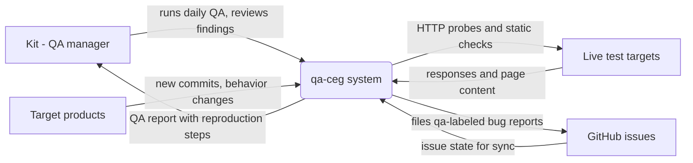
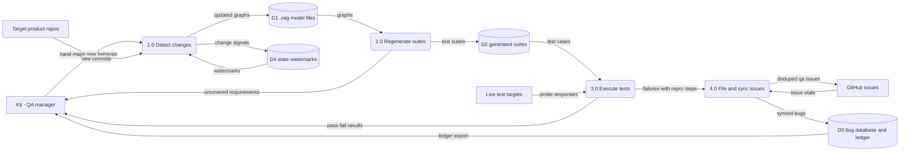

Living document — update these diagrams when adding features.

# qa-ceg — Architecture

Cause-effect graphing QA system. One doctrine: **a good .ceg never uses an
OR gate** — all logic is mapped with AND plus carefully constrained inputs.
Every input on the page goes in the graph, every requirement maps to
effects, every possible outcome is evaluated, then the test suite is
generated. The graphs are the contract, and the contract must be total.

**Role boundary:** the QA manager finds and flags issues with reproduction
steps only. It NEVER debugs and NEVER fixes — programmers debug their own
issues.

## 1. Context diagram (level 0)



Target products (one .ceg graph each): r-theory-rewrite, the forum app
(lampy-admin), lampy-installer, bible-project, and the Facebook profile
daily routine (standing daily management, not a repo).

## 2. Level-1 data flow diagram



Process grounding: `qa_daily.py detect` (1.0: new commits since watermarks in
`state.json`); hand-mapping of new behavior into the .ceg (1.0, human step);
`qa_daily.py regen` → `ceg.py --all` (2.0: parser, Cartesian enumerator,
constraint evaluator, suite generator; exit code = number of requirements
with no covering case, must be 0); `qa_daily.py test` (3.0: theory site via
SSH tunnel, forum flows, installer statics, bible statics + DB checks,
profile routine); `qa_daily.py issues` → `bugs.py` (4.0: files deduped
GitHub issues, label `qa`); `qa_daily.py sync` (4.0: two-way reconciliation
of `bugs.db` with GitHub).

## 3. Entity–relationship diagram

```mermaid
erDiagram
    PRODUCT ||--|| CEG_FILE : modeled_by
    CEG_FILE ||--o{ CEG_INPUT : declares
    CEG_FILE ||--o{ CEG_EFFECT : declares
    CEG_FILE ||--o{ CEG_REQUIREMENT : declares
    CEG_FILE ||--|| TEST_SUITE : generates
    TEST_SUITE ||--o{ TEST_CASE : contains
    TEST_CASE }o--o{ CEG_REQUIREMENT : covers
    TEST_CASE ||--o{ BUG_REPORT : fails_as
    BUG_REPORT }o--|| GITHUB_ISSUE : files_as
    BUG_REPORT ||--o{ SYNC_LOG : records

    PRODUCT {
        string name PK
        string kind
    }
    CEG_FILE {
        string name PK
        string page
    }
    CEG_INPUT {
        string ceg_name FK
        string input_id
        string states
    }
    CEG_EFFECT {
        string ceg_name FK
        string effect_id
        string rule
    }
    CEG_REQUIREMENT {
        string ceg_name FK
        string req_id
        string text
    }
    TEST_SUITE {
        string ceg_name PK_FK
        int combo_count
        int uncovered
    }
    TEST_CASE {
        string case_id PK
        string suite FK
        string signature
        string verdict
    }
    BUG_REPORT {
        int bug_id PK
        string title
        string repro
        string status
    }
    GITHUB_ISSUE {
        int number PK
        string repo
        string title
    }
    SYNC_LOG {
        int log_id PK
        int bug_id FK
        string direction
        string at
    }
```

Notes on the ERD: the public repo holds the model and the generated
suites; the bug database is private by design. `CEG_INPUT.states` is the
bifurcated state list (`name : off | on`, index 0 always the off state);
`CEG_EFFECT.rule` is the AND-only success/fail logic (`e1 <= c1=real`,
`f1 <= c1=spam`); `TEST_SUITE.combo_count` is the Cartesian enumeration
total (e.g. 13,824 for bible-project v2, 2,880 for lampy-installer);
`uncovered` must be 0. The `.tests.json` full suites, `bugs.db`,
`PRIVATE_LEDGER.md` (regenerated export of the bug database), `state.json`
watermarks, and `logs/` stay local via `.gitignore`; only the `.tests.md`
grouped suites are published. `GITHUB_ISSUE` is an external record mirrored
into the sync, not an owned entity.

## Grounding notes

- OBSERVED (repo tree, 2026-09-28): 16 files — `CEG_FORMAT.md`, `ceg.py`
  (285 lines), `bugs.py` (378 lines), `qa_daily.py` (393 lines),
  `ceg/*.ceg` (5 graphs), `suites/*.tests.md` (5 published suites),
  `.gitignore`, `README.md`.
- OBSERVED (`README.md`): the no-OR doctrine; `O(...)` exclusive / `I(...)`
  inclusive / bifurcate naming; success and fail graphs separated with
  `M(a, b)` masks; inputs bifurcated with state index 0 as off;
  `ceg.py --all` must exit 0; daily phases detect → regen → test → issues →
  sync; QA manager role = find and flag with repro steps, never debug or
  fix; issues filed with label `qa` deduplicated by title; `bugs.db` and
  `PRIVATE_LEDGER.md` private, synced two-way with GitHub.
- OBSERVED (`ceg/profile.ceg`): PAGE/INPUTS/SUCCESS/FAIL/REQUIREMENTS
  sections; e.g. `c1 = friend_request : none | real | spam`,
  `e1 <= c1=real`, `f1 <= c1=spam`; Jennifer messages surface as NEEDS YOU
  with no autonomous reply; planned posts carry the AI content flag.
- OBSERVED (`qa_daily.py`): `cmd_detect`, `cmd_regen`, `cmd_test`
  (`check_theory` via SSH tunnel, `check_forum`, `check_installer`,
  `check_bible`, `check_profile`), `cmd_issues`, `cmd_sync`; `state.json`
  watermarks via `load_state`/`save_state`.
- OBSERVED: measured suite sizes recorded 2026-09-28 — bible-project v2:
  13,824 combos, 0 uncovered; lampy-installer: 2,880 combos, 0 uncovered,
  12 groups; forum model debugged to 54/54 PASS.
- INFERRED: the numbered process boundaries 1.0–4.0 follow the daily
  pipeline's named phases; the human hand-mapping step is 1.0's "detect"
  companion (the pipeline detects commits, the QA manager maps behavior).
- INFERRED: entity key shapes in the ERD follow the file formats described
  in `CEG_FORMAT.md`/README; the bug-database table shapes (`repos`,
  `issues`, `sync_log`) are per the 2026-09-28 design note — `bugs.db`
  itself is private and was not read.
